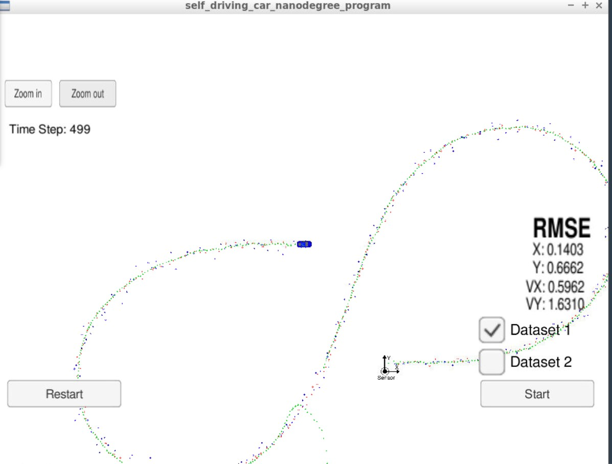
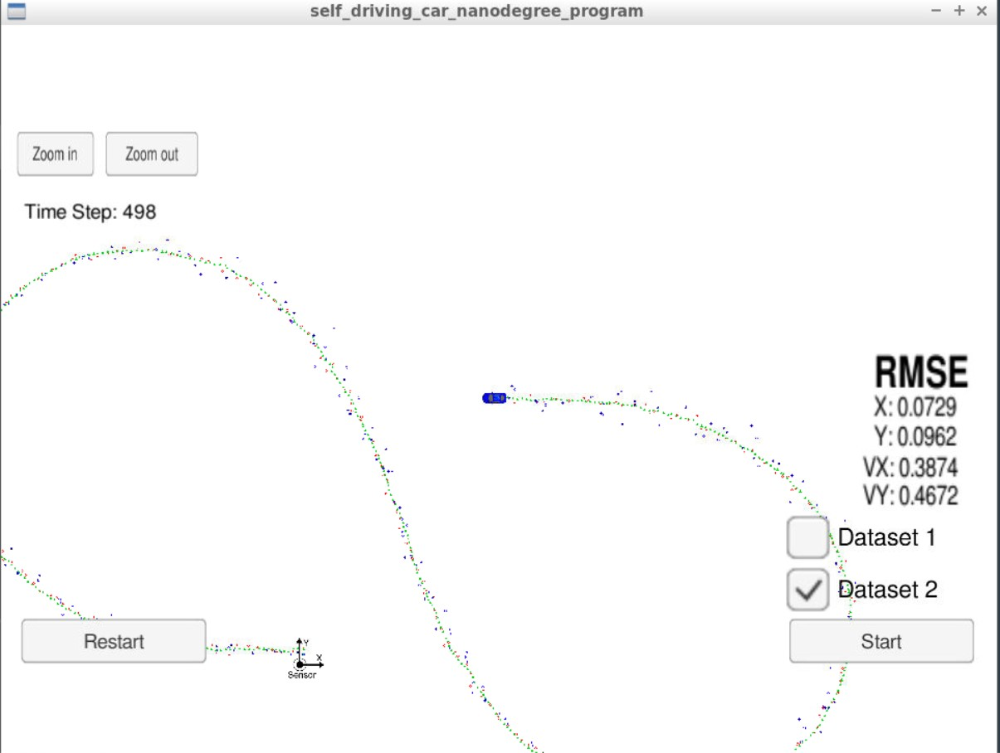

# CarND-Extended-Kalman-Filter

Self-Driving Car Engineer Nanodegree Program

The goal of this project is to build an Extended Kalman Filter using C++ and
use it to estimate the state of a moving object of interest with noisy LIDAR
and RADAR measurements.

The measurements data is provided in the form of a [simulator](https://github.com/udacity/self-driving-car-sim/releases).

The key metrics are [RMSE](https://en.wikipedia.org/wiki/Root-mean-square_deviation) values for both position and velocity of the tracked
object.

## Results

The success metrics for this project are the RMSE values for 2 datasets.

px, py, vx, vy output coordinates must have an RMSE <= [.11, .11, 0.52, 0.52]

### RMSE values

The folowing table lists the results of both datasets:

| RMSE | Dataset 1 | Dataset 2 |
|------|-----------|-----------|
| P x  |  0.1403   |  0.0729   |
| P y  |  0.6662   |  0.0962   |
| V x  |  0.5962   |  0.3874   |
| V y  |  1.6310   |  0.4672   |

It is not clear for me why Dataset 1 "the easy dataset" is below the desired results 
for the RMSE. on the other hand Dataset 2 "The harder Dataset" is fullfilling the 
desired results.

It is unclear at the moment why this is the case.


### Images from the simulator

> With both `Radar` and `Lidar` data.

#### Dataset 1



#### Dataset 2



## Implementation

The code skeleton for this project was provided by udacity on [this repo](https://github.com/udacity/CarND-Extended-Kalman-Filter-Project).

The main program in under the `src` directory.
```
.
├── FusionEKF.cpp
├── FusionEKF.h
├── json.hpp
├── kalman_filter.cpp
├── kalman_filter.h
├── main.cpp
├── measurement_package.h
├── tools.cpp
└── tools.h
```

The main changes were to the folowing files:

- `main.cpp` - reads in data, runs the Kalman filter and calculates RMSE values after each measurement.
- `FusionEKF.cpp` - initializes the filter, calls the `Predict` function and the `Update` function
- `kalman_filter.cpp`- implementation of the `Predict` and `Update` function, for both `lidar` and `radar`.
- `tools.cpp` - tool functions to calculate `RMSE` and the `Jacobian` matrix, used to convert polar to cartesian coordinates


# Contributing

## Dependencies

* cmake >= 3.5
  * All OSes: [click here for installation instructions](https://cmake.org/install/)
* make >= 4.1 (Linux, Mac), 3.81 (Windows)
  * Linux: make is installed by default on most Linux distros
  * Mac: [install Xcode command line tools to get make](https://developer.apple.com/xcode/features/)
  * Windows: [Click here for installation instructions](http://gnuwin32.sourceforge.net/packages/make.htm)
* gcc/g++ >= 5.4
  * Linux: gcc / g++ is installed by default on most Linux distros
  * Mac: same deal as make - [install Xcode command line tools](https://developer.apple.com/xcode/features/)
  * Windows: recommend using [MinGW](http://www.mingw.org/)

## Build

1. Clone this repo.
2. Make a build directory: `mkdir build && cd build`
3. Compile: `cmake .. && make` 
   * On windows, you may need to run: `cmake .. -G "Unix Makefiles" && make`
4. Run it: `./ExtendedKF `

## Editor Settings

We've purposefully kept editor configuration files out of this repo in order to
keep it as simple and environment agnostic as possible. However, we recommend
using the following settings:

* indent using spaces
* set tab width to 2 spaces (keeps the matrices in source code aligned)

## Code Style

Please (do your best to) stick to [Google's C++ style guide](https://google.github.io/styleguide/cppguide.html).
